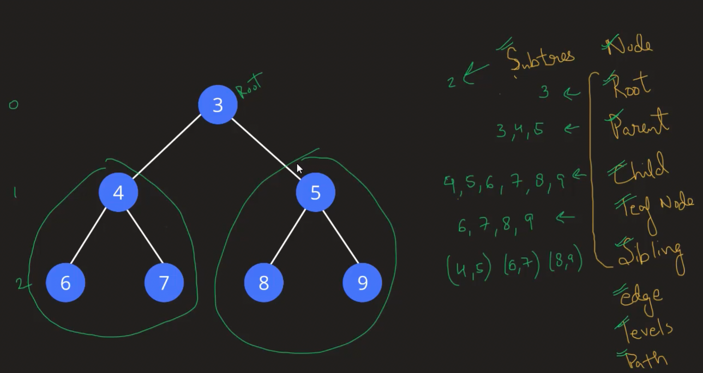

## Tree

* It is one form of graph

### Things that we need to understand
* Node
* Root
* Parent
* Child
* Leaf Node
* Sibling
* Edge
* Levels
* Path
* Subtrees

### Depth

The depth of any node is the number of edges from the node to the root node.

### Height

The height of any node is the number of edges from that node to the deepest leaf.
* Height of the tree = height of the root node